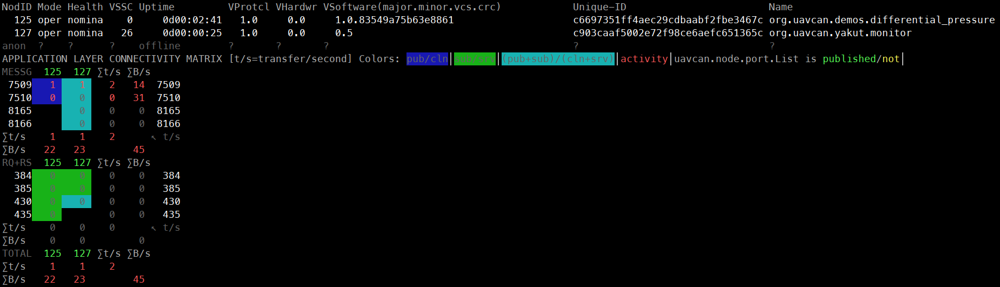
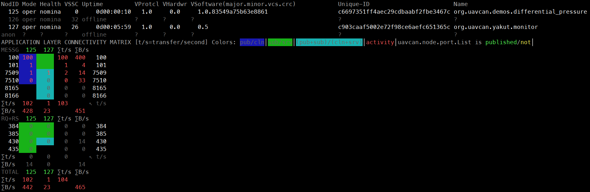

# Differential pressure sensor demo

## Purpose

This demo implements a simple differential pressure & static air temperature sensor node
in a highly portable C application that can be trivially adapted to run in a baremetal environment.
Unless ported, the demo is intended for evaluation on GNU/Linux.

This demo supports only UAVCAN/CAN at the moment, but it can be extended to support UAVCAN/UDP or UAVCAN/serial.


## Preparation

You will need GNU/Linux, CMake, a C11 compiler, [Yakut](https://github.com/UAVCAN/yakut),
and [SocketCAN utils](https://github.com/linux-can/can-utils).

Build the demo as follows:

```bash
git clone --recursive https://github.com/UAVCAN/demos
cd demos/differential_pressure_sensor
mkdir build && cd build
cmake .. && make
```


## Running

Set up a virtual CAN bus `vcan0`:

```bash
modprobe can
modprobe can_raw
modprobe vcan
ip link add dev vcan0 type vcan
ip link set vcan0 mtu 72         # Enable CAN FD by configuring the MTU of 64+8
ip link set up vcan0
```

Launch the node
(it is built to emulate an embedded system so it does not accept any arguments or environment variables):

```bash
./differential_pressure_sensor
```

It may print a few informational messages and then go silent.

Fire up the CAN dump utility from SocketCAN utils and see what's happening on the bus.
You should see the PnP node-ID allocation requests being sent by our node irregularly:

```bash
$ candump -decaxta vcan0
(1616445708.288978)  vcan0  TX B -  197FE510  [20]  FF FF C6 69 73 51 FF 4A EC 29 CD BA AB F2 FB E3 46 7C 00 E9
(1616445711.289044)  vcan0  TX B -  197FE510  [20]  FF FF C6 69 73 51 FF 4A EC 29 CD BA AB F2 FB E3 46 7C 00 EA
# and so on...
```

It will keep doing this forever until it got an allocation response from the node-ID allocator.

Next, we launch a PnP node-ID allocator available in Yakut (PX4 also implements one):

```bash
export UAVCAN__CAN__IFACE="socketcan:vcan0"
export UAVCAN__NODE__ID=127                 # This node-ID is for Yakut.
yakut monitor -P ~/allocation_table.db
```

This command will run the monitor together with the allocator.
You will see our node get itself a node-ID allocated,
then roughly the following picture should appear on the monitor:



That means that our node is running, but it is unable to publish measurements because the respective subjects
remain unconfigured.
Configure them (do not stop the monitor though, otherwise you won't know what's happening on the bus),
assuming that the node got allocated the node-ID of 125:

```bash
export UAVCAN__CAN__IFACE="socketcan:vcan0"
export UAVCAN__NODE__ID=126                 # This node-ID is for Yakut.
yakut call 125 uavcan.register.Access.1.0 "{name: {name: uavcan.pub.airspeed.differential_pressure.id},  value: {natural16: {value: 100}}}"
yakut call 125 uavcan.register.Access.1.0 "{name: {name: uavcan.pub.airspeed.static_air_temperature.id}, value: {natural16: {value: 101}}}"
```

The node is configured now, but we need to restart it before the configuration parameter changes take effect:

```bash
yakut call 125 uavcan.node.ExecuteCommand.1.1 "command: 65535"
```

You should see candump start printing a lot more frames because the demo is now publishing the sensor data.
The monitor will also show the subjects that we just configured.



You can subscribe to the published differential pressure using Yakut as follows:

```bash
export UAVCAN__CAN__IFACE="socketcan:vcan0"
yakut sub 100:uavcan.si.unit.pressure.Scalar.1.0
```

You can erase the configuration and go back to factory defaults as follows:

```bash
export UAVCAN__CAN__IFACE="socketcan:vcan0"
export UAVCAN__NODE__ID=126                 # This node-ID is for Yakut.
yakut call 125 uavcan.node.ExecuteCommand.1.1 "command: 65532"
```


## Porting

Just read the code.

The files `socketcan.[ch]` were taken from <https://github.com/UAVCAN/platform_specific_components>.
You may (or may not) find something relevant for your target platform there, too.
