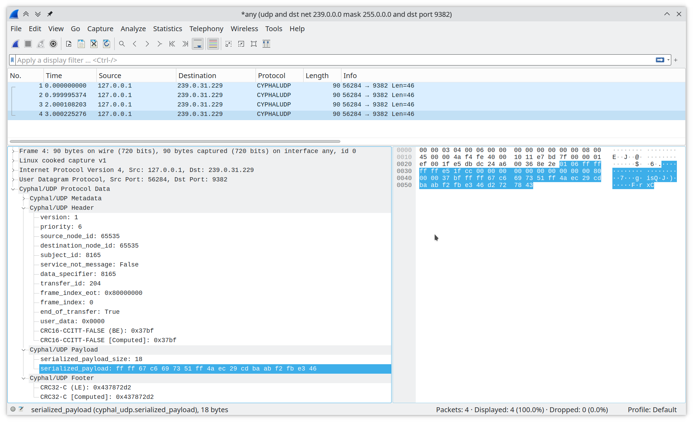
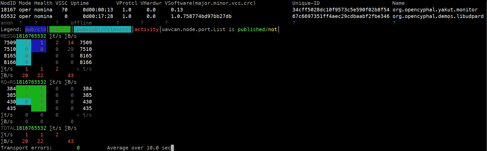
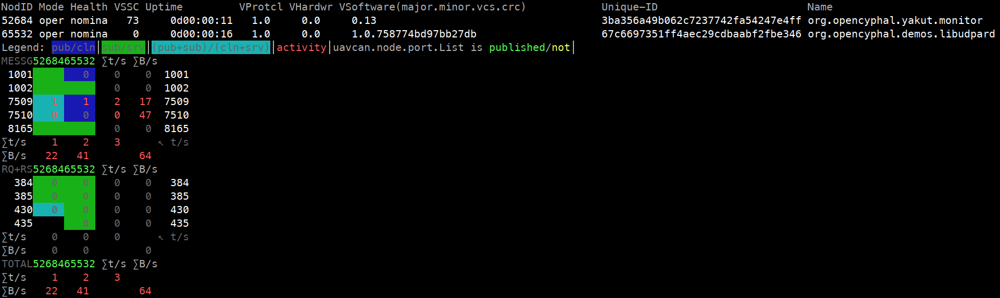

# LibUDPard demo application

This demo application is a usage demonstrator for [LibUDPard](https://github.com/OpenCyphal-Garage/libudpard) ---
a compact Cyphal/UDP implementation for high-integrity systems written in C99.
It implements a simple Cyphal node that showcases the following features:

- Fixed port-ID and non-fixed port-ID publishers.
- Fixed port-ID and non-fixed port-ID subscribers.
- Fixed port-ID RPC server.
- Plug-and-play node-ID allocation unless it is configured statically.
- Fast Cyphal Register API and non-volatile storage for the persistent registers.
- Support for redundant network interfaces.

This document will walk you through the process of building, running, and evaluating the demo
on a GNU/Linux-based OS.
It can be easily ported to another platform, such as a baremetal MCU,
by replacing the POSIX socket API and stdio with suitable alternatives;
for details, please consult with `udp.h` and `storage.h`.

## Preparation

Install the [Yakut](https://github.com/OpenCyphal/yakut) CLI tool,
Wireshark with the [Cyphal plugins](https://github.com/OpenCyphal/wireshark_plugins),
and ensure you have CMake and a C11 compiler.
Build the demo:

```shell
git clone --recursive https://github.com/OpenCyphal/demos
cd demos/libudpard
mkdir build && cd build
cmake .. && make
```

## Running

At the first launch the default parameters will be used.
Upon their modification, the state will be saved on the filesystem in the current working directory
-- you will see a new file appear per parameter (register).

Per the default settings, the node will use only the local loopback interface.
If it were an embedded system, it could be designed to run a DHCP client to configure the local interface(s)
automatically and then use that configuration.

Run the node:

```shell
./demo
```

It will print a few informational messages and then go silent.
With the default configuration being missing, the node will be attempting to perform a plug-and-play node-ID allocation
by sending allocation requests forever until an allocation response is received.
You can see this activity --- PnP requests being published --- using Wireshark;
to exclude unnecessary traffic, use the following BPF expression:

```bpf
udp and dst net 239.0.0.0 mask 255.0.0.0 and dst port 9382
```



It will keep doing this forever until it got an allocation response from the node-ID allocator.
Note that most high-integrity systems would always assign static node-ID instead of relying on this behavior
to ensure deterministic behaviors at startup.

To let our application complete the PnP allocation stage, we launch the PnP allocator implemented in Yakut monitor
(this can be done in any working directory):

```shell
UAVCAN__UDP__IFACE="127.0.0.1" UAVCAN__NODE__ID=$(yakut accommodate) y mon -P allocation_table.db
```

This will create a new file called `allocation_table.db` containing, well, the node-ID allocation table.
Once the allocation is done (it takes a couple of seconds), the application will announce this by printing a message,
and then the normal operation will be commenced.
The Yakut monitor will display the following picture:



The newly allocated node-ID value will be stored in the `uavcan.node.id` register,
but it will not be committed into the non-volatile storage until the node is commanded to restart.
This is because storage I/O is not compatible with real-time execution,
so the storage is only accessed during startup of the node (to read the values from the non-volatile memory)
and immediately before shutdown (to commit values into the non-volatile memory).

It is best to keep the Yakut monitor running and execute all subsequent commands in other shell sessions.

Suppose we want the node to use another network interface aside from the local loopback `127.0.0.1`.
This is done by entering additional local interface addresses in the `uavcan.udp.iface` register separated by space.
You can do this with the help of Yakut as follows (here we are assuming that the allocated node-ID is 65532):

```shell
export UAVCAN__UDP__IFACE="127.0.0.1"  # Pro tip: move these export statements into a shell file and source it.
export UAVCAN__NODE__ID=$(yakut accommodate)
y r 65532 uavcan.udp.iface "127.0.0.1 192.168.1.200"  # Update the local addresses to match your setup.
```

To let the new configuration take effect, the node has to be restarted.
Before restart the register values will be committed into the non-volatile storage;
configuration files will appear in the current working directory of the application.

```shell
y cmd 65532 restart
```

The Wireshark capture will show that the node is now sending data via two interfaces concurrently
(or however many you configured).

Next we will evaluate the application-specific publisher and subscriber.
The application can receive messages of type `uavcan.primitive.array.Real32.1`
and re-publish them with the reversed order of the elements.
The corresponding publisher and subscriber ports are both named `my_data`,
and their port-ID registers are named `uavcan.pub.my_data.id` and  `uavcan.sub.my_data.id`,
per standard convention.
As these ports are not configured yet, the node is unable to make use of them.
Configure them manually as follows
(you can also use a YAML file with the `y rb` command for convenience; for more info see Yakut documentation):

```shell
y r 65532 uavcan.pub.my_data.id 1001  # You can pick arbitrary values here.
y r 65532 uavcan.sub.my_data.id 1002
```

Then restart the node, and the Yakut monitor will display the newly configured ports in the connectivity matrix:



To evaluate this part of the application,
subscribe to the topic it is supposed to publish on using the Yakut subscriber tool:

```shell
y sub +M 1001:uavcan.primitive.array.real32
```

Use another terminal to publish some data on the topic that the application is subscribed to
(you can use a joystick to generate data dynamically; see the Yakut documentation for more info):

```shell
y pub 1002:uavcan.primitive.array.real32 '[50, 60, 70]'
```

The subscriber we launched earlier will show the messages published by our node:

```yaml
1001:
  _meta_: {ts_system: 1693821518.340156, ts_monotonic: 1213296.516168, source_node_id: 65532, transfer_id: 183, priority: nominal, dtype: uavcan.primitive.array.Real32.1.0}
  value: [70.0, 60.0, 50.0]
```

Publishing and subscribing using different remote machines (instead of using the local loopback interface)
is left as an exercise to the reader.
Cyphal/UDP is a masterless peer protocol that does not require manual configuration of the networking infrastructure.
As long as the local interface addresses are set correctly, the Cyphal distributed system will just work out of the box.
Thus, you can simply run the same publisher and subscriber commands on different computers
and see the demo node behave the same way.

The only difference to keep in mind is that Yakut monitor may fail to display all network traffic unless the computer
it is running on is connected to a SPAN port (mirrored port) of the network switch.
This is because by default, IGMP-compliant switches will not forward multicast packets into ports for which
no members for the corresponding multicast groups are registered.

To reset the node configuration back to defaults, use this:

```shell
y cmd 65532 factory_reset
```

As the application is not allowed to access the storage I/O during runtime,
the factory reset will not take place until the node is restarted.
Once restarted, the configuration files will disappear from the current working directory.

## Porting

Just read the code. Focus your attention on `udp.c` and `storage.c`.
