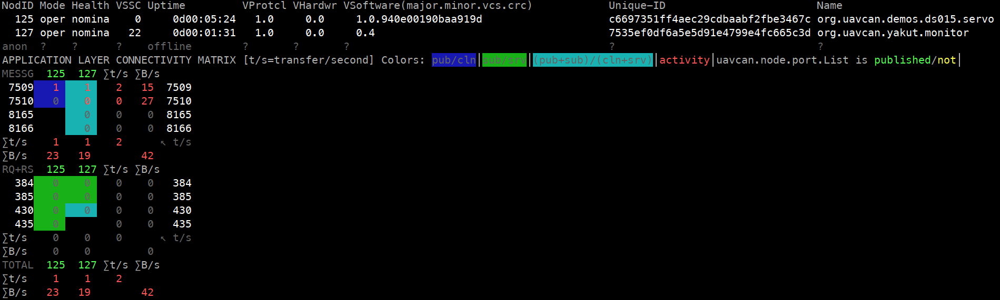
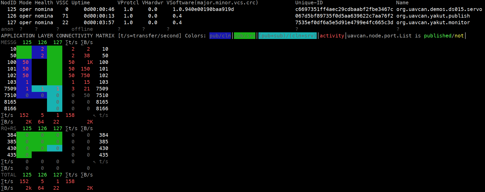

# UDRAL servo demo

## Purpose

This demo implements the full [UDRAL](https://github.com/OpenCyphal/public_regulated_data_types/)
servo network service in a highly portable C application that can be trivially
adapted to run in a baremetal environment.
Unless ported, the demo is intended for evaluation on GNU/Linux.

This demo supports only Cyphal/CAN at the moment, but it can be extended to support Cyphal/UDP or Cyphal/serial.

The servo network service is defined for two kinds of actuators: translational and rotary.
The only difference is that one uses `reg.udral.physics.dynamics.translation.Linear`,
and the other uses `reg.udral.physics.dynamics.rotation.Planar`.
The types can be replaced if necessary.

UDRAL comes with a hard requirement that a node shall be equipped with non-volatile memory for keeping the
node registers (that is, configuration parameters).
It is not possible to construct a compliant implementation without non-volatile memory.


## Preparation

You will need GNU/Linux, CMake, a C11 compiler, [Yakut](https://github.com/OpenCyphal/yakut),
and [SocketCAN utils](https://github.com/linux-can/can-utils).

Build the demo as follows:

```bash
git clone --recursive https://github.com/OpenCyphal/demos
cd demos/udral_servo
mkdir build && cd build
cmake .. && make
```


## Running

Set up a virtual CAN bus `vcan0`:

```bash
modprobe can
modprobe can_raw
modprobe vcan
ip link add dev vcan0 type vcan
ip link set vcan0 mtu 72         # Enable CAN FD by configuring the MTU of 64+8
ip link set up vcan0
```

Launch the node
(it is built to emulate an embedded system, so it does not accept any arguments or environment variables):

```bash
./udral_servo_demo
```

It may print a few informational messages and then go silent.

Fire up the CAN dump utility from SocketCAN utils and see what's happening on the bus.
You should see the PnP node-ID allocation requests being sent by our node irregularly:

```bash
$ candump -decaxta vcan0
(1616445708.288978)  vcan0  TX B -  197FE510  [20]  FF FF C6 69 73 51 FF 4A EC 29 CD BA AB F2 FB E3 46 7C 00 E9
(1616445711.289044)  vcan0  TX B -  197FE510  [20]  FF FF C6 69 73 51 FF 4A EC 29 CD BA AB F2 FB E3 46 7C 00 EA
# and so on...
```

It will keep doing this forever until it got an allocation response from the node-ID allocator.

A practical system would always assign static node-ID instead of relying on this behavior to ensure
deterministic behaviors at startup.
This, however, cannot be done until we have a node-ID allocated so that we are able to configure the node via Cyphal.
Therefore, we launch a PnP node-ID allocator available in Yakut (PX4 also implements one):

```bash
export UAVCAN__CAN__IFACE="socketcan:vcan0"
export UAVCAN__NODE__ID=127                 # This node-ID is for Yakut.
y mon --plug-and-play ~/allocation_table.db
```

This command will run the monitor together with the allocator.
You will see our node get itself a node-ID allocated,
then roughly the following picture should appear on the monitor:



That means that our node is running,
but it is unable to perform any servo-related activities because the respective subjects remain unconfigured.
So let's configure them (do not stop the monitor though, otherwise you won't know what's happening on the bus),
assuming that the node got allocated the node-ID of 125.
First, it helps to know what registers are available at all:

```bash
$ export UAVCAN__CAN__IFACE="socketcan:vcan0"
$ export UAVCAN__NODE__ID=126                   # This node-ID is for Yakut.
$ y rl 125
[reg.udral.service.actuator.servo, uavcan.can.mtu, uavcan.node.description, uavcan.node.id, uavcan.node.unique_id, uavcan.pub.servo.dynamics.id, uavcan.pub.servo.dynamics.type, uavcan.pub.servo.feedback.id, uavcan.pub.servo.feedback.type, uavcan.pub.servo.power.id, uavcan.pub.servo.power.type, uavcan.pub.servo.status.id, uavcan.pub.servo.status.type, uavcan.sub.servo.readiness.id, uavcan.sub.servo.readiness.type, uavcan.sub.servo.setpoint.id, uavcan.sub.servo.setpoint.type, udral.pnp.cookie]
$ y rl 125, | y rb                              # You can also read all registers like this
# (output not shown)
```

Configure the subject-IDs (you can also make a YAML file with params and apply it using `y rb`):

```bash
y r 125 uavcan.sub.servo.readiness.id 10
y r 125 uavcan.sub.servo.setpoint.id  50
y r 125 uavcan.pub.servo.dynamics.id  100
y r 125 uavcan.pub.servo.feedback.id  101
y r 125 uavcan.pub.servo.power.id     102
y r 125 uavcan.pub.servo.status.id    103
```

The node is configured now, but we need to restart it before the configuration parameter changes take effect:

```bash
y cmd 125 restart -e
```

You should see candump start printing a lot more frames (approx. 150 per second).
The demo should still print `DISARMED` in the terminal.
Let's arm it and publish some setpoint (specifying the types is optional):

```bash
y pub --period=0.5 --count=30 \
    10:reg.udral.service.common.readiness 3 \
    50:reg.udral.physics.dynamics.translation.linear 'kinematics: {position: -3.14}'
```

You will see the message that is printed on the terminal change from `DISARMED`
to the current setpoint values.
The monitor should show you something close to this:



Shortly after the publisher is stopped the servo will automatically disarm itself, as dictated by the UDRAL standard.

You can listen for the dynamics subject published by the node as follows:

```bash
y sub 100:reg.udral.physics.dynamics.translation.LinearTs
```

You can erase the configuration and go back to factory defaults as follows:

```bash
y cmd 125 factory_reset
```

If you have a joystick or a MIDI controller,
you can control the servo interactively using `yakut publish` as shown in this video:

[](https://www.youtube.com/watch?v=wTuWtrrI1m0)

The corresponding command is (adjust the axes/buttons as necessary):

```bash
y pub --period=0.1 \
    10:reg.udral.service.common.readiness '!$ "T(1,3) * 3"' \
    50:reg.udral.physics.dynamics.translation.linear 'kinematics: {velocity: !$ "A(1,4)*10"}'
```


## Porting

Just read the code.

The files `socketcan.[ch]` were taken from <https://github.com/OpenCyphal/platform_specific_components>.
You may (or may not) find something relevant for your target platform there, too.
